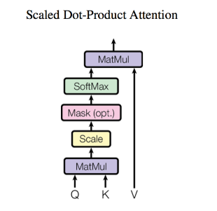
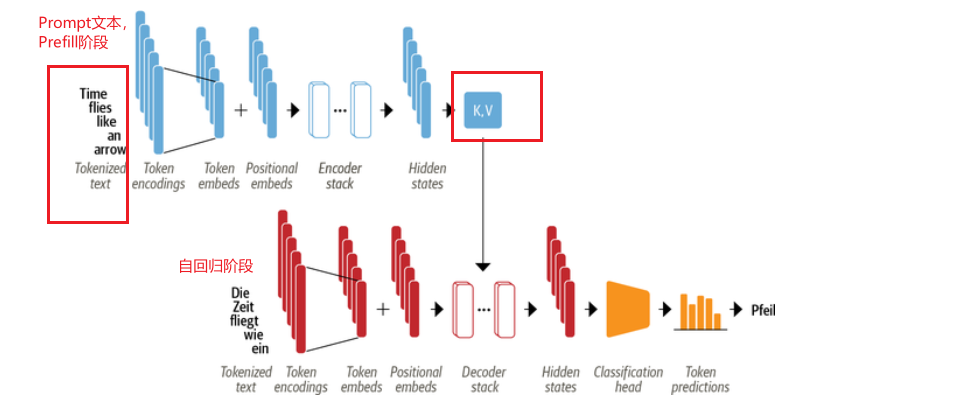
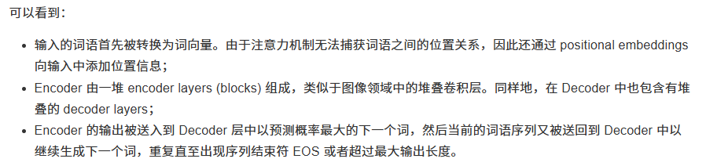
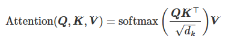
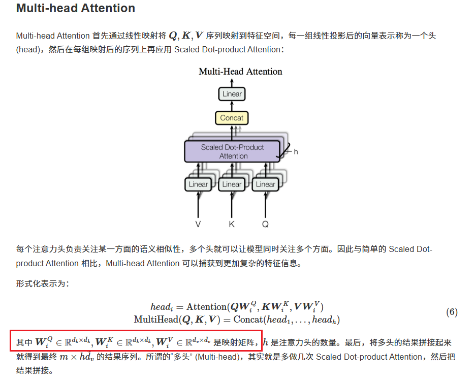

[HuggingFace Transformer 讲解第三章：MHA](https://transformers.run/c1/attention/)

**Scaled Dot-Product Attention：**

K 和 V都是辅助的，Q是实际要处理的Embedding。

Scale是为了防止上个矩阵乘法的结果过大，Maks（点乘）是为了去掉“padding”作用的词。

如果$Q\in R^{m\times d_k}$ 表示：有m条query（就是Embedding），每条query的维度是$d_k$。

如果$K\in R^{n\times d_k}$ 表示：对应有n条key，n条k是Encoder编码的“用户的输入”生成的，每条key的维度是$d_k$。

如果$V\in R^{n\times d_v}$ 表示，对应有n条value，n条v是Encoder编码的“用户的输入”生成的，每条key的维度是$d_v$。**不是$d_k$**。

因此，最终是把$m\times d_k$变为了$n \times d_v$。

然后，如果我们加上batch_size，那么在程序中，Q、K、V的维度如下：

1. $Q$：$[batch\_size, m(num\_queries),d_k]$。
2. $K$：$[batch\_size, n(num\_key), d_k]$

3. $V$：$[batch\_size,n(num_values),d_v]$

**多头注意力机制**

简单来说，就是将原本的

